= Tx Signing - PoC
:toc:

== Intro

An Spring Boot backend app to sing registry data using Vault's Transits engine

== Running

This Spring Boot application can be started by `mvn spring-boot:run` or by starting the SignignApplication's main method.

It exposes two http endpoints

.  /api-signing/sign to sign data

. /api-signing/verify to verify the signed data

== Initial vault configuration for signing

Initial setup has been performed using the Vault UI. The setup can also be performed with a CLI
command or an API call, which would be most useful for automating configuration.

TIP: Instructions are here for reference only, since the setup is already automated in the
custom docker image prepared in uk-ets-vault repository.

==== Enable the 'Transit' engine

Go to the Secrets menu and Press Enable new engine

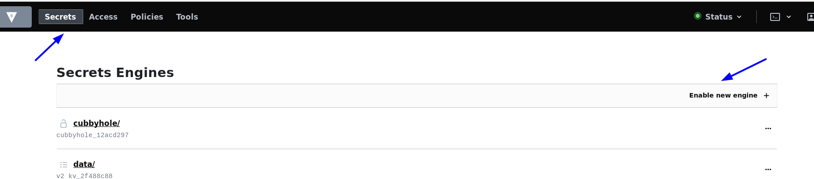

Select the 'Transit' engine
image::image-2020-09-29-17-03-24-705.png[width=940]

Hit Next, name it 'ukets-transit-engine' and Press 'Enable Engine'

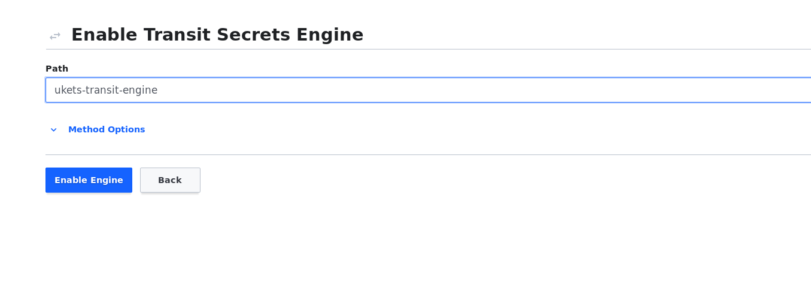

==== Create a new encryption key that supports signing

Enter the newly created 'ukets-transit-engine' and Select 'Create encryption key'

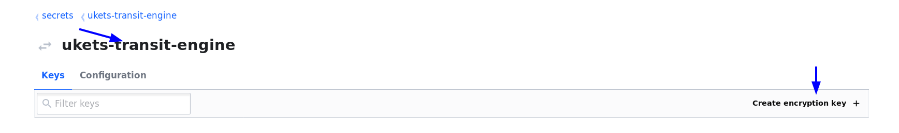

Name the key sign-key and select 'ed25519' type from the Type dropdown menu. This key type supports signing.

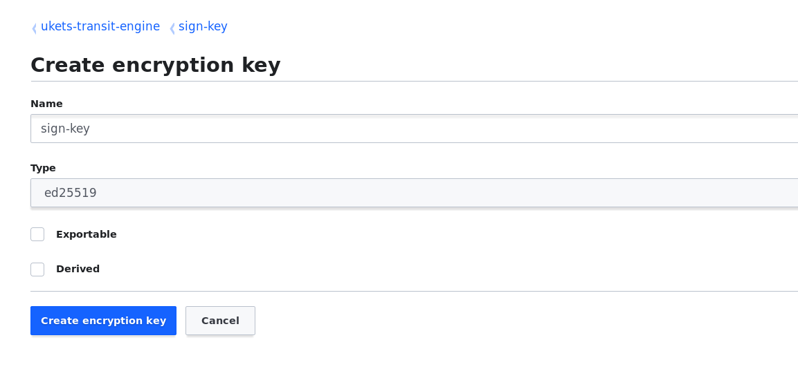

==== Create a new policy

From the Policies menu on the top select 'Create ACL policy'

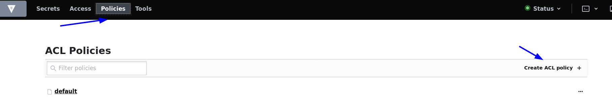

Name the policy 'ukets-transit-engine-policy' and paste the following code into the policy window.

[source, javascript]
path "ukets-transit-engine/*" {
  capabilities = [ "update" ]
}

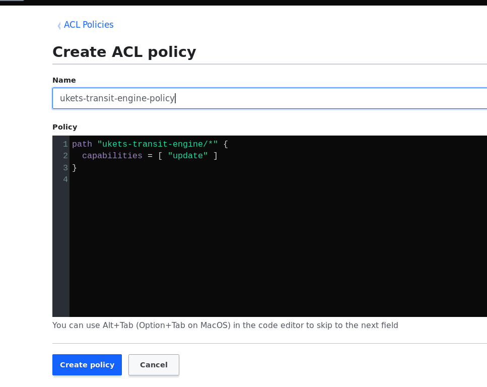

This path will allow the policy to sign using all keys that are created under the ukets-transit-engine.
The actual paths for signing is ukets-transit-engine/sign/sign-key and for
verification uket-transit-engine/verify/sign-key

TIP: Signing keys need to have the 'update' capability, the read capability as 'read' capability only allows reading
e.g secrets and it is not appropriate for signing.

==== Enable AppRole authentication method

The following section is based on the official https://www.vaultproject.io/guides/identity/authentication[AppRole Pull Authentication] guide
at the Vault website.

After logging to the vault UI and from the top menu select access and press 'Enable new method'

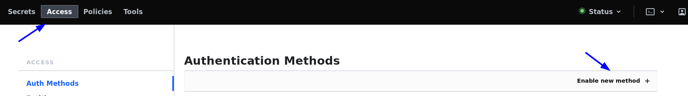

Select AppRole method and press Next

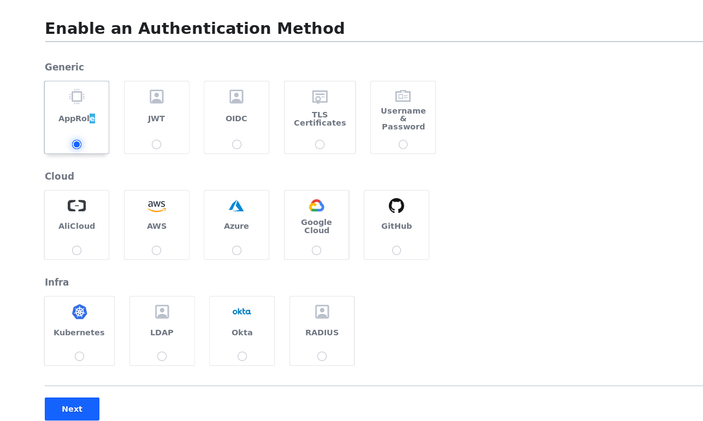

Leave the Path name 'approle' and hit Enable Method

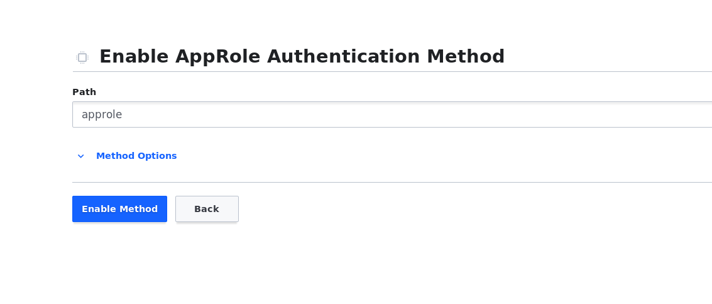

==== Create a role for the signing application

Open the vault browser from the right side of the top level menu

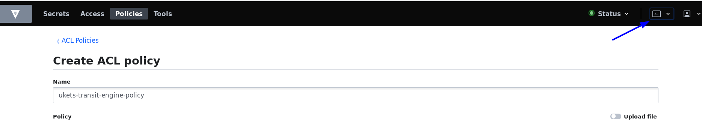
Create a new role 'signing-app' and associate it with the 'ukets-transit-engile-policy'

`vault write auth/approle/role/signing-app token_policies="ukets-transit-engine-policy" token_ttl=1h token_max_ttl=4h`

Get the RoleID and Sected Id with the following commands

`vault read auth/approle/role/signing-app/role-id`

`vault write -force auth/approle/role/signing-app/secret-id`

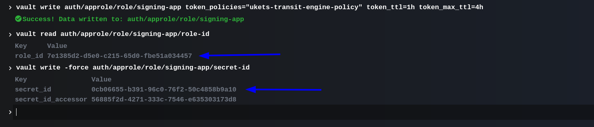

== References

1. Setup docker and curl requests video tutorial https://www.youtube.com/watch?v=vd9f-gGqMV0
2. Spring Vault documentation https://spring.io/projects/spring-vault
