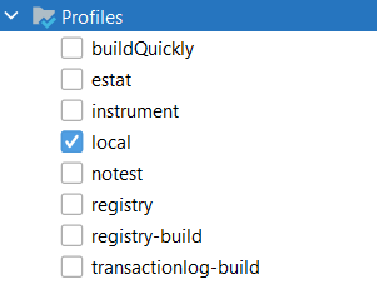
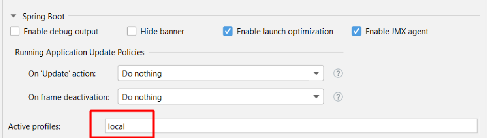

= UI Logs Microservice

== Usage

The purpose of this Microservice is to provide an endpoint for a UI to send an array of JSON strings,
that represent front end logs associated with a specific client/session, that will be published to Cloudwatch.

In production the logs are published in a Cloudwatch compatible format. This is the *default* configuration for building the module.

However, in development / local environments the developers would want to see logs in a human readable format,
therefore the *local* profile is being provided. The associated scenarios are the following:

1. To build: `mvn clean install -P local`
2. To run the project locally: `mvn spring-boot:run -P local` or `_runme.sh`
3. To build the project with a local configuration in order for it to be deployed to a local docker container: `_buildme.sh`
4. From within *Intellij* the *local* profile for maven should be enabled, and in the Spring Boot application configuration the local **Active Profile** should be set as in the images below:

